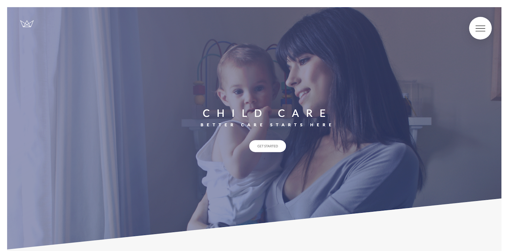
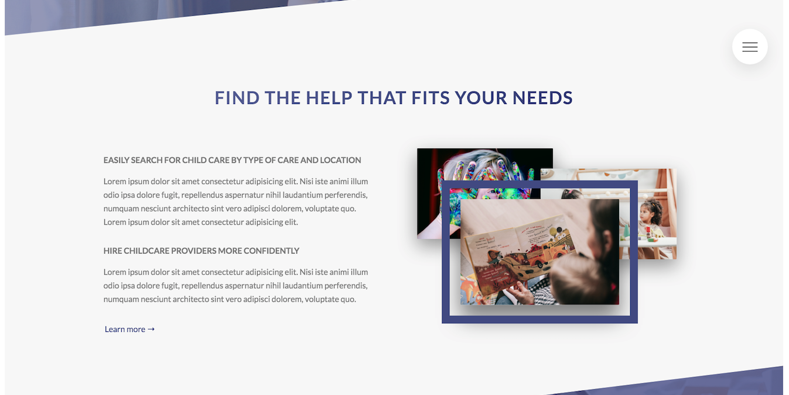
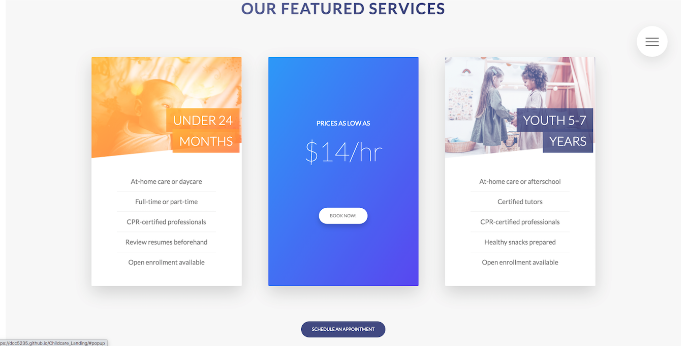
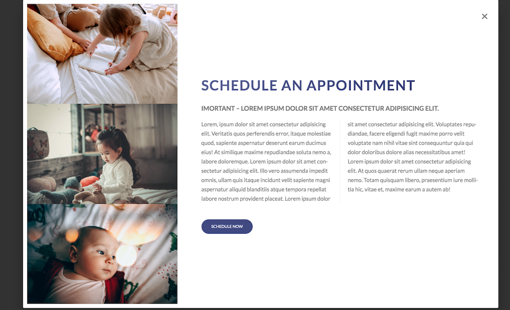
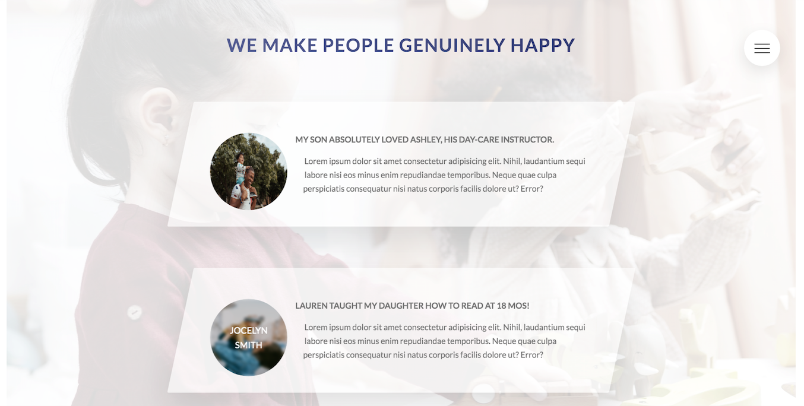
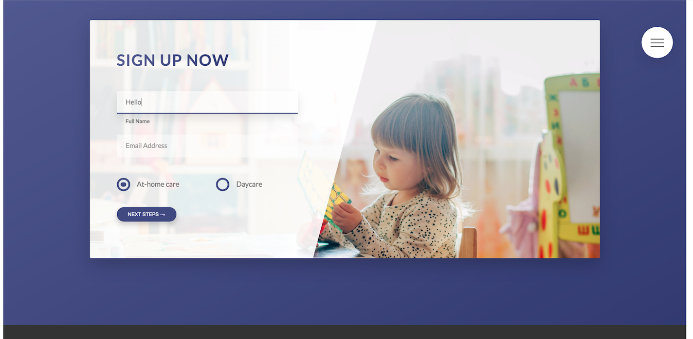

# Care for You Landing Page   

### Checkout the Live Version of the [Project](https://dcc5235.github.io/Childcare_Landing/)!

**HTML5, CSS3, SCSS**

A responsive, sample landing page for a childcare company. The site includes fixed/responsive hamburger menu, video background, clickable pop-ups, form with customized radio buttons, keyframes animation, call to action features based on BEM and 7-1 architecture, NPM scripts, and variable mixins within the code.

---

## Installation & Technologies

- Download the full package, select the Code button, choose the "Download ZIP" option.
- Requires Node.js to run: install [Node.js](https://nodejs.org/en/), current version.
  - <code>npm install</code> to install the Node Sass and libraries, specifically these packages will also be installed.
    - "autoprefixer"
    - "concat"
    - "node-sass"
    - "npm-run-all"
    - "postcss-cli"
  - <code>npm run start</code> to open local server.
- SASS/SCSS: install [Sass](https://sass-lang.com/install), current version.

---

## Project Highlights

Section | Features
------------ | -------------
[Navigation](#Navigation) | Responsive navigation bar with hover effect; Links are animated and have linear gradient and bezier features. Navbar remains fixed on entire page.
[Header](#Header) | Animated header title and button with linear gradient background overlay on image.
[Main: Section 1](#Main1) | Responsive text aligned next to photos that have hover effect over images. Secondary images reduce in size when one image is selected.
Main: Section 2 | Info cards with hover effect over image with gradient background overlay.
[Main: Section 3](#Main3) | Services card with gradient overlay over images. Hover effect flips card to reveal clickable booking button and prices. Click feature creates popup.
[Main: Section 4](#Main4) | Stories container with hover effect over image that reveals client names. Containers featured over video background.
[Main: Section 5](#Main5) | Form with customized radio buttons. Form input moves as users type information in textbox. 

## Navigation

## Header

## Main1

## Main3

## Main4

## Main5

---

## Credits

- Images from [Unsplash.com](https://unsplash.com/) and [Pexels.com](https://www.pexels.com/) licensed under Creative Commons Zero
- Design by Jonas Schmedtmann

---

## Contributors

Dany Chheang dany.chheang@gmail.com
